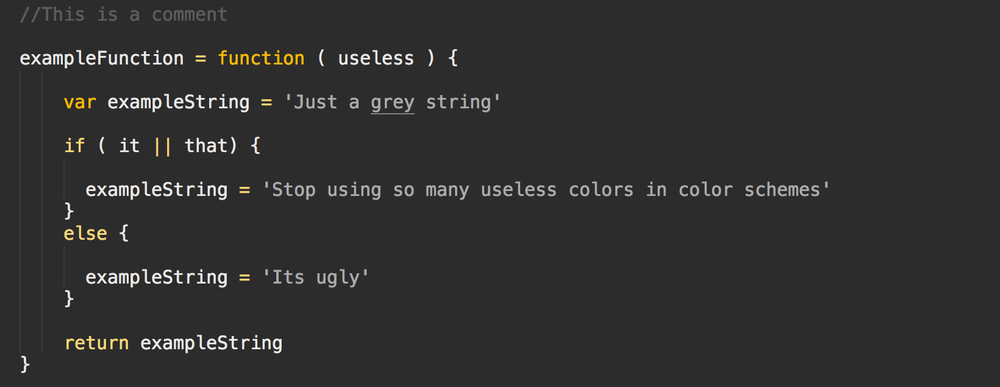
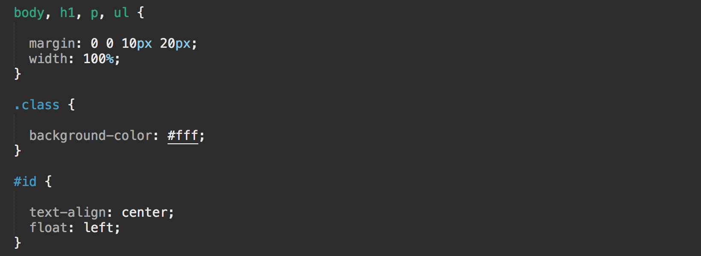

Conduct Color Scheme
====================

Conduct languages in color in Sublime Text.

* Each language is designated a color.
* Keywords are a lighter color. (generally)
* Definitions are a darker color. (generally)
* Strings are light grey.
* Comments are dark grey.

This is something I toy around with here and there hoping I eventually find a working color scheme just right for the things I do at work. After 8 hours of digging through different languages my brain can kind of shut down so these colors help keep me pointed. Pleanty of improvements can and will be made.

### Simple and readable

### You know where to find blocks of functionality. Dark red.

### Notice how HTML elements are green like the HTML markup below.

### Look at that yellow script tag. Just like the yellow JS code.

Totally easy to see CSS. Even easier to so PHP.

